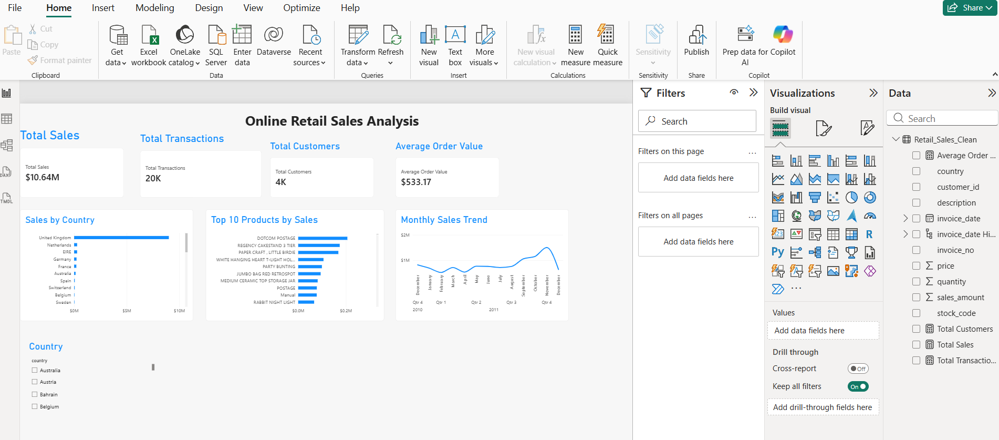

# Online Retail Sales Analysis

## Project Overview

This project analyzes online retail transaction data to understand sales performance, product performance, customer activity, and sales trends over time.

The project follows an end-to-end analytics workflow using **Excel/Power Query, SQL, and Power BI**.

## Dashboard Preview

## Business Questions

- What are the total sales and number of transactions?
- How do sales vary by country and month?
- Which products generate the most sales?
- Which customers generate the most sales?
- What are the month-over-month sales changes?
- What are the top-performing products within each country?

## Dataset

The project uses the **Online Retail II** dataset, containing transactional information such as invoice number, product, quantity, invoice date, unit price, customer ID, and country.

The original dataset contained **541,910 records**.

## Data Cleaning

Data preparation was performed using **Excel Power Query**.

Key steps included:

- Removed exact duplicate rows.
- Excluded negative-quantity transactions from the primary sales analysis.
- Excluded zero-price transactions.
- Retained transactions with missing Customer IDs for overall sales analysis, while excluding them from customer-level analysis.
- Converted invoice dates to date format.
- Standardized column names.
- Created `sales_amount` as `Quantity × UnitPrice`.

The raw dataset was preserved separately from the cleaned dataset.

## SQL Analysis

SQL was used to calculate sales metrics and identify patterns in the data.

Analysis included:

- Total sales
- Sales by country
- Monthly sales trends
- Top 10 products by sales
- Top customers by sales
- Month-over-month sales using `LAG()`
- Product rankings by country using `DENSE_RANK()`

The SQL analysis produced a total sales value of **$10,642,124.90**, which was validated against the Power BI result.

## Power BI Dashboard

The dashboard includes:

- Total Sales
- Total Transactions
- Total Customers
- Average Order Value
- Sales by Country
- Top 10 Products by Sales
- Monthly Sales Trend
- Country slicer for interactive filtering

## Key Findings

- The **United Kingdom** generates the largest share of sales by a significant margin.
- **DOTCOM POSTAGE** is the highest-selling line by sales amount and should be reviewed separately to determine whether it represents postage or another operational charge rather than merchandise.
- Sales increase substantially toward the end of 2011, with **November showing a notable peak**.

## Recommendations

1. **Prioritize the UK market** through customer retention and product availability while continuing to evaluate growth opportunities in other high-performing markets.

2. **Plan inventory and marketing ahead of the late-year peak**, using the historical sales pattern to prepare for higher demand.

3. **Separate operational charges from merchandise sales** when evaluating product performance, particularly for high-value lines such as DOTCOM POSTAGE.

## Tools Used

- **Excel / Power Query** — Data cleaning and preparation
- **SQL / SQLite** — Data analysis
- **Power BI** — Dashboard and visualization
- **Git / GitHub** — Version control and portfolio presentation

## What I Learned

This project strengthened my practical experience with data cleaning, SQL analysis, window functions, data validation, KPI development, dashboard design, and translating data findings into business recommendations.
